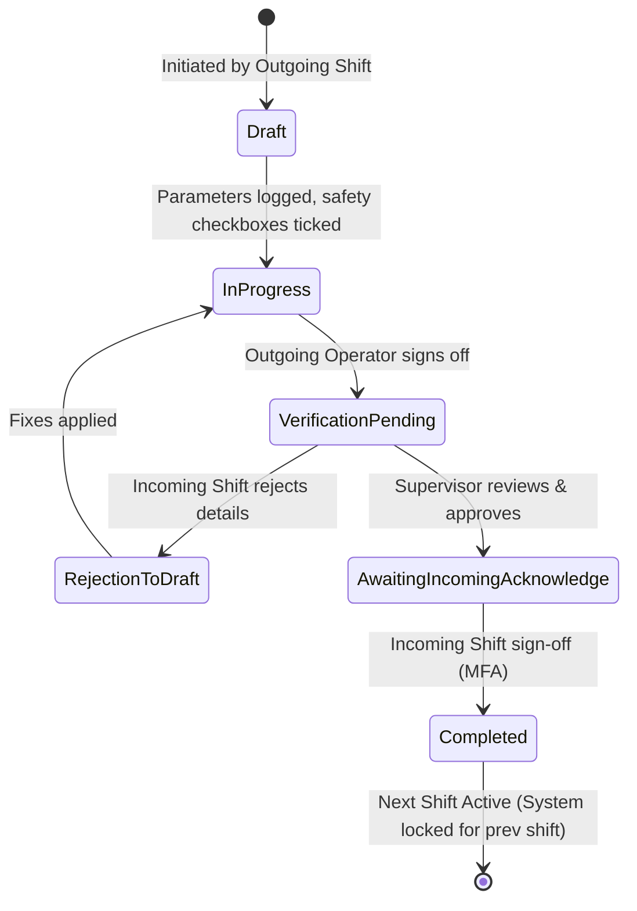
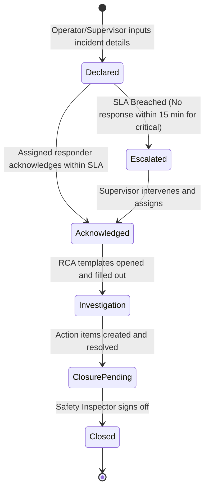
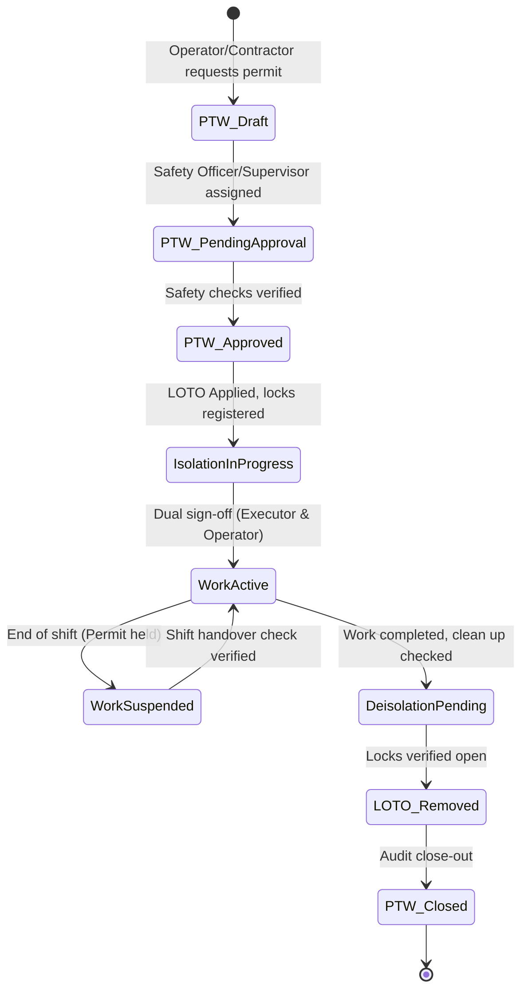

# Product Requirement Document (PRD): IOCL Digital Logbook & Operations Platform

## Document Metadata
- **Version**: 1.0.0
- **Status**: Ready for Review / Developer-Ready
- **Target Audience**: Product Managers, Software Engineers, UI/UX Designers, QA Engineers, Security Auditors

---

## 1. Executive Summary & Architecture Overview

The **IOCL Digital Logbook & Operations Platform** is an enterprise-grade web application tailored for downstream energy operations (refineries, pipeline assets, LPG bottling plants, and R&D facilities). By replacing legacy paper logs, ad hoc communication, and manual shift handovers, this platform establishes a secure, auditable, and offline-resilient operational record.

### 1.1 High-Level Architecture Diagram
The system follows a decoupling strategy, where offline-first frontend clients sync asynchronously with backend services through a secure API gateway.

```mermaid
graph TD
    subgraph Client Layer (Offline-First)
        A["React SPA (Client Web App)"] --> B["IndexedDB (Local Store)"]
        A --> C["Sync Engine (Client)"]
    end

    subgraph API Gateway & Security
        C --> D["API Gateway / Reverse Proxy"]
        D --> E["SSO / OAuth2 Middleware"]
        D --> F["RBAC Rate Limiting Middleware"]
    end

    subgraph Microservices Layer
        D --> G["Shift Logbook Service"]
        D --> H["Handover Wizard Service"]
        D --> I["Incident & War Room Service"]
        D --> J["Permit to Work & LOTO Service"]
        D --> K["Notification & Broadcast Service"]
        D --> L["Sync & Conflict Resolution Engine"]
        D --> M["Audit Logger (Immutable)"]
    end

    subgraph Data Layer
        G & H & I & J & K & L & M --> N[(PostgreSQL Primary DB)]
        M --> O[(Immutable Write-Once Audit Store)]
        L --> P[(Redis Cache / Session Sync)]
    end

    subgraph External Systems
        E --> Q["Enterprise IdP (SSO / MFA)"]
        K --> R["SMS / Email Gateways"]
    end
```

---

## 2. Information Architecture & UX Design System

To ensure readability under extreme operating environments (such as control rooms or field tablets under sunlight), the UI uses a high-density, low-strain, high-contrast visual hierarchy.

### 2.1 Design Tokens

| Token Category | Value | Application |
| :--- | :--- | :--- |
| **Primary Color** | HSL(215, 80%, 25%) (Deep Indigo Blue) | Navigation Header, Active Icons, Brand Identity |
| **Secondary/Accent Color** | HSL(24, 95%, 50%) (Vibrant Safety Orange) | Warnings, Primary Action Buttons, Incomplete States |
| **Danger/Critical Alert** | HSL(0, 85%, 45%) (Crimson Red) | Out-of-bounds parameters, High Severity Incidents, LOTO |
| **Success Alert** | HSL(145, 63%, 32%) (Forest Green) | Safe parameters, Completed Handover, Restored Permits |
| **Dark Theme Background** | HSL(220, 20%, 10%) (Charcoal Navy) | Control Room Night Mode (minimizes eye strain) |
| **Light Theme Background** | HSL(210, 20%, 98%) (Cool Slate White) | Field Tablet Day Mode (reduces glare under sunlight) |
| **Typography** | `Outfit`, sans-serif (Display), `Inter` (UI elements) | Readability at small sizes on high-density grids |

### 2.2 Wireframe Layout Specifications

#### 2.2.1 Control Room Consolidated Dashboard Layout
```
+-----------------------------------------------------------------------------------------+
| [LOGO] IOCL OPS   Dashboard | Logbook | Handover | Incidents | Permits |  [Operator Mode] |
+-----------------------------------------------------------------------------------------+
| SYSTEM BANNER: [CRITICAL INCIDENT] Zone B LPG Pipeline pressure drops below threshold   |
+-----------------------------------------------------------------------------------------+
|                                  Active Shift: Shift A (06:00 - 14:00) | In-Charge: Roy  |
+-----------------------------------------------------------------------------------------+
|  +--------------------------+  +--------------------------+  +------------------------+ |
|  | Unit Status Cards        |  | Safety KPIs              |  | Pending Action Drawer  | |
|  | * Atmospheric Distill: OK|  | * Safe Days: 421 days    |  | * 3 Log parameters due | |
|  | * Vacuum Distill: Alert  |  | * Open LOTO: 12 assets   |  | * Handover signoff req | |
|  | * LPG Bottling: OK       |  | * Active Permits: 8 hot  |  | * Acknowledge Order(1) | |
|  +--------------------------+  +--------------------------+  +------------------------+ |
|                                                                                         |
|  +------------------------------------------------------------------------------------+ |
|  | Active Shift Log Summary Grid                                                      | |
|  | Time   | Parameter       | Value     | Target Limit | Status    | Entered By       | |
|  | 10:00  | T-101 Temperature| 420.5 C   | 380 - 410 C  | [EXCESS]  | J. Doe (Operator)| |
|  | 10:00  | P-102 Pressure   | 14.2 Bar  | 10.0-15.0 Bar| [NORMAL]  | J. Doe (Operator)| |
|  +------------------------------------------------------------------------------------+ |
+-----------------------------------------------------------------------------------------+
```

---

## 3. Core Workflows & State Diagrams

The logic layers of the system are driven by strict, finite state-machines designed to prevent process bypasses.

### 3.1 Shift Handover Wizard Workflow
A shift handover cannot be completed without explicit verification from the outgoing shift and digital acknowledgment from the incoming shift.



### 3.2 Incident Management Workflow
All incident states require audit trails and auto-escalation paths.



### 3.3 Permit to Work (PTW) and LOTO State Machine
The system links Permits to physical locking points to prevent premature activation.



---

## 4. Complete Database Schemas & Data Model

To ensure absolute auditability and sync safety, every table contains system columns for synchronization conflicts and structural auditability. Below is the PostgreSQL DDL representing the core data layer.

```sql
-- Enable UUID generator
CREATE EXTENSION IF NOT EXISTS "uuid-ossp";

-- 1. Roles Table
CREATE TABLE roles (
    role_id UUID PRIMARY KEY DEFAULT uuid_generate_v4(),
    role_name VARCHAR(50) UNIQUE NOT NULL,
    description TEXT,
    created_at TIMESTAMP WITH TIME ZONE DEFAULT CURRENT_TIMESTAMP
);

-- Insert system roles
INSERT INTO roles (role_name, description) VALUES
('PLANT_OPERATOR', 'Logs hourly readings, triggers incidents, requests permits'),
('SHIFT_IN_CHARGE', 'Reviews and signs off handovers, releases standing orders'),
('SAFETY_OFFICER', 'Approves PTW/LOTO, oversees incident RCAs and closures'),
('MAINTENANCE_COORDINATOR', 'Tracks assets and schedules isolation procedures'),
('CORPORATE_AUDITOR', 'Read-only access to historical logs and reports'),
('SYSTEM_ADMIN', 'Manages users, assets, and plant zone settings');

-- 2. Users Table
CREATE TABLE users (
    user_id UUID PRIMARY KEY DEFAULT uuid_generate_v4(),
    username VARCHAR(100) UNIQUE NOT NULL,
    email VARCHAR(255) UNIQUE NOT NULL,
    password_hash VARCHAR(255) NOT NULL,
    role_id UUID REFERENCES roles(role_id) ON DELETE RESTRICT,
    plant_zone VARCHAR(100) NOT NULL,
    is_active BOOLEAN DEFAULT TRUE,
    created_at TIMESTAMP WITH TIME ZONE DEFAULT CURRENT_TIMESTAMP
);

-- 3. Asset Registry Table
CREATE TABLE assets (
    asset_id UUID PRIMARY KEY DEFAULT uuid_generate_v4(),
    asset_tag VARCHAR(100) UNIQUE NOT NULL,
    asset_name VARCHAR(255) NOT NULL,
    plant_zone VARCHAR(100) NOT NULL,
    description TEXT,
    min_safe_limit NUMERIC(10,4),
    max_safe_limit NUMERIC(10,4),
    metric_unit VARCHAR(20),
    is_isolated BOOLEAN DEFAULT FALSE,
    updated_at TIMESTAMP WITH TIME ZONE DEFAULT CURRENT_TIMESTAMP
);

-- 4. Shift Logs Table
CREATE TABLE shift_logs (
    log_id UUID PRIMARY KEY DEFAULT uuid_generate_v4(),
    user_id UUID REFERENCES users(user_id),
    asset_id UUID REFERENCES assets(asset_id),
    parameter_value NUMERIC(10,4) NOT NULL,
    is_out_of_bounds BOOLEAN GENERATED ALWAYS AS (
        parameter_value < min_safe_limit OR parameter_value > max_safe_limit
    ) STORED,
    min_safe_limit NUMERIC(10,4) NOT NULL, -- Snapshot at time of entry
    max_safe_limit NUMERIC(10,4) NOT NULL, -- Snapshot at time of entry
    recorded_at TIMESTAMP WITH TIME ZONE NOT NULL,
    offline_created_at TIMESTAMP WITH TIME ZONE,
    sync_status VARCHAR(20) DEFAULT 'SYNCED', -- 'SYNCED', 'PENDING', 'CONFLICT'
    client_mutation_id UUID UNIQUE,           -- Client side tracking ID
    created_at TIMESTAMP WITH TIME ZONE DEFAULT CURRENT_TIMESTAMP
);

-- 5. Shift Handover Table
CREATE TABLE handovers (
    handover_id UUID PRIMARY KEY DEFAULT uuid_generate_v4(),
    outgoing_shift_in_charge UUID REFERENCES users(user_id),
    incoming_shift_in_charge UUID REFERENCES users(user_id),
    shift_date DATE NOT NULL,
    shift_type VARCHAR(20) NOT NULL, -- 'A', 'B', 'C'
    equipment_status_summary TEXT NOT NULL,
    active_incidents_summary TEXT NOT NULL,
    active_permits_summary TEXT NOT NULL,
    status VARCHAR(30) DEFAULT 'DRAFT', -- 'DRAFT', 'PENDING_INCOMING', 'COMPLETED'
    outgoing_signed_at TIMESTAMP WITH TIME ZONE,
    incoming_signed_at TIMESTAMP WITH TIME ZONE,
    created_at TIMESTAMP WITH TIME ZONE DEFAULT CURRENT_TIMESTAMP
);

-- 6. Incidents Table
CREATE TABLE incidents (
    incident_id UUID PRIMARY KEY DEFAULT uuid_generate_v4(),
    reporter_id UUID REFERENCES users(user_id),
    asset_id UUID REFERENCES assets(asset_id),
    title VARCHAR(255) NOT NULL,
    description TEXT NOT NULL,
    severity VARCHAR(20) NOT NULL, -- 'LOW', 'MEDIUM', 'HIGH', 'CRITICAL'
    status VARCHAR(30) DEFAULT 'DECLARED', -- 'DECLARED', 'ACKNOWLEDGED', 'INVESTIGATION', 'CLOSED'
    sla_escalation_deadline TIMESTAMP WITH TIME ZONE,
    is_escalated BOOLEAN DEFAULT FALSE,
    acknowledged_by UUID REFERENCES users(user_id),
    acknowledged_at TIMESTAMP WITH TIME ZONE,
    rca_findings TEXT,
    closure_signed_by UUID REFERENCES users(user_id),
    closed_at TIMESTAMP WITH TIME ZONE,
    created_at TIMESTAMP WITH TIME ZONE DEFAULT CURRENT_TIMESTAMP
);

-- 7. Permits to Work (PTW) Table
CREATE TABLE permits (
    permit_id UUID PRIMARY KEY DEFAULT uuid_generate_v4(),
    permit_number VARCHAR(100) UNIQUE NOT NULL,
    category VARCHAR(50) NOT NULL, -- 'HOT_WORK', 'CONFINED_SPACE', 'HEIGHT_WORK', 'COLD_WORK'
    asset_id UUID REFERENCES assets(asset_id),
    applicant_id UUID REFERENCES users(user_id),
    approver_id UUID REFERENCES users(user_id),
    status VARCHAR(30) DEFAULT 'PTW_DRAFT',
    valid_from TIMESTAMP WITH TIME ZONE,
    valid_until TIMESTAMP WITH TIME ZONE,
    safety_precautions TEXT[],
    created_at TIMESTAMP WITH TIME ZONE DEFAULT CURRENT_TIMESTAMP
);

-- 8. Lockout-Tagout (LOTO) Record Table
CREATE TABLE loto_records (
    loto_id UUID PRIMARY KEY DEFAULT uuid_generate_v4(),
    permit_id UUID REFERENCES permits(permit_id) ON DELETE CASCADE,
    asset_id UUID REFERENCES assets(asset_id),
    isolation_point VARCHAR(255) NOT NULL,
    lock_number VARCHAR(100) NOT NULL,
    tag_description TEXT,
    applied_by UUID REFERENCES users(user_id),
    applied_at TIMESTAMP WITH TIME ZONE DEFAULT CURRENT_TIMESTAMP,
    removed_by UUID REFERENCES users(user_id),
    removed_at TIMESTAMP WITH TIME ZONE
);

-- 9. Immutable System Audit Events Table
CREATE TABLE audit_events (
    audit_id UUID PRIMARY KEY DEFAULT uuid_generate_v4(),
    actor_id UUID REFERENCES users(user_id),
    actor_role VARCHAR(50) NOT NULL,
    action_type VARCHAR(50) NOT NULL, -- 'CREATE', 'UPDATE', 'APPROVE', 'CLOSE', 'DELETE'
    target_table VARCHAR(50) NOT NULL,
    target_row_id UUID NOT NULL,
    before_state JSONB,
    after_state JSONB,
    source_ip VARCHAR(45) NOT NULL,
    source_device_fingerprint VARCHAR(255),
    event_timestamp TIMESTAMP WITH TIME ZONE DEFAULT CURRENT_TIMESTAMP,
    payload_hash VARCHAR(64) NOT NULL -- SHA256 of row contents to detect tampering
);

-- Index audit events for fast querying and reports
CREATE INDEX idx_audit_target ON audit_events (target_table, target_row_id);
CREATE INDEX idx_audit_timestamp ON audit_events (event_timestamp DESC);
```

---

## 5. REST & Synchronisation API Specifications

All endpoints require authorization via JSON Web Tokens (JWT) passed in the `Authorization` header.

### 5.1 Shift Logs Ingestion API

#### `POST /api/v1/logs`
Creates a shift log entry. Used for real-time online postings.
*   **Access Control**: `PLANT_OPERATOR`, `SHIFT_IN_CHARGE`
*   **Request Payload**:
```json
{
  "asset_id": "8c5eb3cf-68b3-4f9e-ad11-d007c6f0ea99",
  "parameter_value": 412.50,
  "recorded_at": "2026-07-16T19:55:00+05:30",
  "client_mutation_id": "df290b22-8356-42d4-bb36-9b5b290cbdf2"
}
```
*   **Response Payload (`201 Created`)**:
```json
{
  "log_id": "f5127263-d343-4e4b-97c0-a7d519bfa11b",
  "asset_id": "8c5eb3cf-68b3-4f9e-ad11-d007c6f0ea99",
  "parameter_value": 412.50,
  "is_out_of_bounds": true,
  "min_safe_limit": 380.00,
  "max_safe_limit": 410.00,
  "recorded_at": "2026-07-16T19:55:00+05:30",
  "sync_status": "SYNCED",
  "created_at": "2026-07-16T19:55:02+05:30"
}
```

---

### 5.2 Offline Queue Sync Protocol API

#### `POST /api/v1/sync`
Batch reconciles local mutations queued while a client was offline.
*   **Access Control**: All Authenticated Roles.
*   **Request Payload**:
```json
{
  "device_fingerprint": "DESKTOP-CONTROL-ROOM-B",
  "mutations": [
    {
      "mutation_id": "df290b22-8356-42d4-bb36-9b5b290cbdf2",
      "target_table": "shift_logs",
      "action": "CREATE",
      "payload": {
        "asset_id": "8c5eb3cf-68b3-4f9e-ad11-d007c6f0ea99",
        "parameter_value": 412.50,
        "recorded_at": "2026-07-16T19:55:00+05:30"
      },
      "offline_timestamp": "2026-07-16T19:55:00+05:30"
    },
    {
      "mutation_id": "787c88b7-4c8d-4f7f-a67b-1cbfe69a7c3f",
      "target_table": "incidents",
      "action": "CREATE",
      "payload": {
        "asset_id": "8c5eb3cf-68b3-4f9e-ad11-d007c6f0ea99",
        "title": "Minor steam leak identified on main line",
        "description": "Observed sound and drop in outlet pressure.",
        "severity": "MEDIUM"
      },
      "offline_timestamp": "2026-07-16T19:58:00+05:30"
    }
  ]
}
```
*   **Response Payload (`200 OK`)**:
```json
{
  "sync_summary": {
    "total_received": 2,
    "applied": 2,
    "conflicts": 0
  },
  "results": [
    {
      "mutation_id": "df290b22-8356-42d4-bb36-9b5b290cbdf2",
      "status": "SUCCESS",
      "server_id": "f5127263-d343-4e4b-97c0-a7d519bfa11b"
    },
    {
      "mutation_id": "787c88b7-4c8d-4f7f-a67b-1cbfe69a7c3f",
      "status": "SUCCESS",
      "server_id": "0b157492-d332-4752-9b2f-488f28df13b2"
    }
  ]
}
```

---

### 5.3 Audit Read API

#### `GET /api/v1/audit-logs`
Enables structured extraction of tamper-evident system logs.
*   **Access Control**: `CORPORATE_AUDITOR`, `SYSTEM_ADMIN`
*   **Parameters**:
    *   `start_date` (ISO Date)
    *   `end_date` (ISO Date)
    *   `target_table` (String, Optional)
    *   `limit` (Integer, Default: 50)
*   **Response Payload (`200 OK`)**:
```json
{
  "data": [
    {
      "audit_id": "5fa23282-3d84-40ef-871d-f8ad7c50a012",
      "actor_username": "r.sharma",
      "actor_role": "SHIFT_IN_CHARGE",
      "action_type": "APPROVE",
      "target_table": "handovers",
      "target_row_id": "848d76db-9087-4318-ae76-32d84c8aefd1",
      "event_timestamp": "2026-07-16T14:10:00Z",
      "payload_hash": "2cf24dba5fb0a30e26e83b2ac5b9e29e1b161e5c1fa7425e73043362938b9824",
      "source_ip": "10.22.4.115"
    }
  ],
  "pagination": {
    "total_records": 1282,
    "limit": 50,
    "offset": 0
  }
}
```

---

## 6. Offline-First Synchronization Protocol

To ensure continuous operation in isolated processing units and remote pipelines, the platform functions with an **Offline-First** model using client-side IndexedDB storage.

```
       [ Offline Mode ]                      [ Online Sync Mode ]
   +-----------------------+              +------------------------+
   | Client logs parameters|              | Client detects network |
   |  offline in browser.  |              | ping is successful.    |
   +-----------+-----------+              +-----------+------------+
               |                                      |
               v                                      v
   +-----------+-----------+              +-----------+------------+
   | Mutation pushed to    |              | Push queued events in  |
   | Local IndexedDB Queue |              | order to /api/v1/sync  |
   +-----------+-----------+              +-----------+------------+
               |                                      |
               v                                      v
   +-----------+-----------+              +-----------+------------+
   | UI renders state as   |              | Resolve conflict using |
   | "Pending Sync" (amber)|              | "Last Write Wins" rule |
   +-----------------------+              +------------------------+
```

### 6.1 Conflict Resolution Strategy

| Conflict Scenario | Mechanism | Detail |
| :--- | :--- | :--- |
| **Simultaneous Parameter Modification** | Last Write Wins (LWW) based on Device NTP timestamp | If two operators edit the same log entry, the system records both in the audit history but saves the latest timestamped value as the primary entry. |
| **Shift Handover Sign-off Clash** | Sequential Lockout | A handover object signed on the server locks client alterations. Any offline sign-offs attempting to sync after closure are rejected, prompting the client to re-authenticate and verify. |
| **Duplicate Incident Reporting** | Threshold Grouping | If identical assets report high-severity incidents within 5 minutes of each other from separate offline clients, the system merges them under a primary ticket and creates secondary references. |

---

## 7. Requirements Traceability Matrix (RTM)

| Req ID | Req Description | Data Entities | API Endpoints | Test Verification Cases |
| :--- | :--- | :--- | :--- | :--- |
| **REQ-8.1** | Enforce RBAC rules at routing and API layer. | `User`, `Role` | `POST /api/v1/auth/login` | Verify operator cannot access audit endpoints (`403 Forbidden`). |
| **REQ-8.3** | Validate parameters against Safe Operating Limits (SOL). | `LogEntry`, `Asset` | `POST /api/v1/logs` | Post a reading of `450 C` for asset with limit `410 C`. System must tag as `is_out_of_bounds = true` and highlight. |
| **REQ-8.4** | Block shift handovers until required items are addressed. | `Handover` | `POST /api/v1/handovers` | Attempt handover with open critical incidents unassigned. Handover must fail with code `400 Bad Request`. |
| **REQ-8.9** | Keep mutations in a local queue and sync sequentially. | `LogEntry`, Local DB | `POST /api/v1/sync` | Turn off network, record 3 logs. Confirm logs appear as yellow badges. Enable network and verify database insertion. |
| **REQ-12.0**| Capture immutable system details on data mutations. | `AuditEvent` | `/api/v1/audit-logs` | Perform edit. Retrieve audit trail and confirm hash matches calculated value. Check user IP is recorded. |

---

## 8. Milestone Requirements & User Stories (Phase 1 Focused)

Phase 1 focuses on building the Core Shell, Handover flow, Logbook inputs, and base Audit engine.

### User Story 1: Out-of-Bounds Log Validation
**As a** Plant Operator
**I want to** enter hourly asset readings and get instant validation visual tags
**So that** I don't submit invalid, safe-operating-limit-breaking parameters without checking.

#### Acceptance Criteria
*   **Scenario 1: Entry is within normal parameters**
    *   **Given** that the asset `Compressor C-101` has a Safe Operating Limit (SOL) between `10 Bar` and `15 Bar`.
    *   **When** I enter `12.5 Bar` in the pressure input.
    *   **Then** the input field outline displays in neutral blue/gray, and the field status remains marked as normal.
*   **Scenario 2: Entry exceeds safe operating limits**
    *   **Given** that the asset `Compressor C-101` has a SOL between `10 Bar` and `15 Bar`.
    *   **When** I enter `16.2 Bar` in the pressure input.
    *   **Then** the field outline immediately turns Crimson Red (`HSL(0, 85%, 45%)`) and displays a warning tag: `Value exceeds safe operating limit of 15.0 Bar`.
*   **Scenario 3: Value submission is tracked**
    *   **Given** that an out-of-bounds parameter has been entered.
    *   **When** I click the submit button.
    *   **Then** the system inserts the row into `shift_logs` with `is_out_of_bounds` evaluated as `true`, and generates a corresponding warning entry in the dashboard panel.

---

### User Story 2: Shift Handover Wizard Checklists
**As a** Shift In-Charge
**I want a** guided checklist wizard to verify safety permits and status flags
**So that** the incoming Shift In-Charge can take over with full awareness of open risk items.

#### Acceptance Criteria
*   **Scenario 1: Incomplete items prevent handovers**
    *   **Given** that there are active, unacknowledged permits and unlogged critical items.
    *   **When** I click "Prepare Handover Wizard".
    *   **Then** the wizard displays an error checklist summary and disables the "Sign Handover" step.
*   **Scenario 2: Multi-step process navigation**
    *   **Given** that the previous step parameters are satisfied.
    *   **When** I move through the wizard steps: `Step 1: Check Asset Logs` -> `Step 2: Review Permits` -> `Step 3: Review Open Incidents`.
    *   **Then** the system caches the inputs in the draft phase and checks each validation criteria as complete.
*   **Scenario 3: Sign-off locks editing state**
    *   **Given** that all items are verified and step validations pass.
    *   **When** I enter my authorization pin to submit.
    *   **Then** the system signs off with a timestamp, updates `status` to `PENDING_INCOMING`, and locks the outgoing shift log parameters from further modification.

---

### User Story 3: Tamper-Evident Audit Trails
**As a** Corporate Auditor
**I want** every database state mutation to write a separate hash-linked record to an audit table
**So that** we can prove to external regulators that records have not been altered or deleted retrospectively.

#### Acceptance Criteria
*   **Scenario 1: Capture details on mutation**
    *   **Given** that an Operator edits a previously entered parameter.
    *   **When** the record is successfully updated in `shift_logs`.
    *   **Then** a record is created in `audit_events` with the actor's ID, the action set to `UPDATE`, the original value in `before_state`, and the updated value in `after_state`.
*   **Scenario 2: Verification of event payload integrity**
    *   **Given** that an audit event is registered.
    *   **When** the database writes the audit event.
    *   **Then** the system generates a `payload_hash` using a SHA-256 calculation of the concatenated fields: `actor_id + action_type + target_row_id + before_state::text + after_state::text + event_timestamp`.
*   **Scenario 3: Tamper warning generation**
    *   **Given** that a script tries to alter historical values in `audit_events`.
    *   **When** a verification query checks row hashes.
    *   **Then** any row where the recalculated SHA-256 hash does not match the stored `payload_hash` is flagged as a safety violation on the Auditor's dashboard.

---

## 9. Security, Geofencing & Compliance Parameters

To meet the high security standard of downstream petroleum assets, the system implements three layers of security validations:

1.  **Transport & Cryptographic Layers**
    *   All API traffic must use TLS 1.3.
    *   Data stored in Local IndexedDB queues is encrypted at rest using AES-GCM-256 with keys stored securely in the browser's credential storage (accessed via authentication session lifecycle).
2.  **Geofencing Authorization (Optional Extension)**
    *   The API gateway parses access requests and permits mutations only when the source IP falls within the configured corporate VPN or plant intranet subnets (`10.0.0.0/8`).
    *   External or public IPs are granted read-only access to authorized dashboard resources.
3.  **Step-Up Verification**
    *   High-risk actions (e.g. initiating a LOTO lock release, signing off a handover, approving a hot work permit) require step-up authentication. The user must re-enter their SSO credentials or supply an MFA token before the action is executed.
